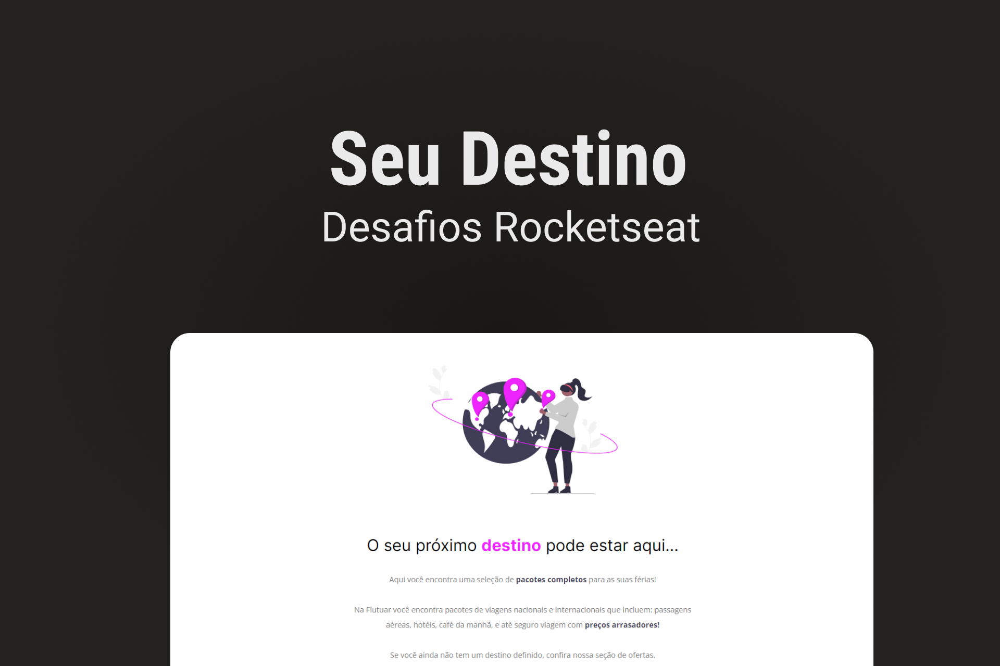

<h1 align="center">Seu destino</h1>

  <a href="#-tecnologias">Tecnologias</a>&nbsp;&nbsp;&nbsp;|&nbsp;&nbsp;&nbsp;
  <a href="#-projeto">Projeto</a>

  

## 🚀 Tecnologias

Esse projeto foi desenvolvido com as seguintes tecnologias:

- HTML
- CSS
- Git e Github
- Figma

Bibliotecas

- [Google Fonts](https://fonts.google.com/)

## 💻 Projeto

 È uma aplicação estatica com o objetivo de mostrar as informações de viagens

- [Acesse o projeto finalizado, online](https://lkaua22k.github.io/SeuDestino/)

---

Feito com ♥ by Kauã :wave:
